# FlashBet AI - Real-Time Prediction Markets on Linera

---

## 🎯 Live Demo

**Frontend**: https://flashbet-ai.vercel.app
**Backend API**: https://warning-apparel-journal-pst.trycloudflare.com

**Production Status**: ✅ Live on Conway Testnet with 10 demo markets

**Quick Commands**:
- Check Status: `./scripts/check_status.sh`
- Run Demo: `./scripts/demo_full_cycle.sh`

---

## 🗓️ Development Roadmap

```mermaid
gantt
    title FlashBet AI - Linera Buildathon 2025 Roadmap
    dateFormat YYYY-MM-DD
    axisFormat %b %d

    section Wave 1 ✅
    MVP Foundation           :done, w1, 2025-10-20, 10d

    section Wave 2
    Security & Wallets       :active, w2, 2025-11-03, 10d

    section Wave 3
    Market Expansion         :w3, 2025-11-17, 10d

    section Wave 4
    Order Book System        :w4, 2025-12-01, 10d

    section Wave 5
    Security & Expansion     :w5, 2025-12-15, 24d

    section Wave 6
    Optimization & Social    :w6, 2026-01-12, 10d

    section Post-Hackathon
    Enterprise Features      :p1, 2026-02-01, 90d
    Global Expansion         :p2, 2026-05-01, 90d
    Ecosystem Growth         :p3, 2026-08-01, 120d
    Full Decentralization    :p4, 2027-01-01, 180d
```



### Hackathon Waves (Oct 2025 - Jan 2026)

| Wave | Period | Focus | Status |
|------|--------|-------|--------|
| **Wave 1** | Oct 20-29 | MVP Foundation | ✅ Complete |
| **Wave 2** | Nov 3-12 | Security & Wallets | 🔄 Next |
| **Wave 3** | Nov 17-26 | Market Expansion | 📋 Planned |
| **Wave 4** | Dec 1-10 | Order Book System | 📋 Planned |
| **Wave 5** | Dec 15-Jan 7 | Security & Expansion | 📋 Planned |
| **Wave 6** | Jan 12-21 | Optimization & Social | 📋 Planned |

#### Wave Details

**Wave 1: MVP Foundation** ✅
- 3 Linera microchains deployed (User, Market, Oracle)
- Multi-market architecture with 10 demo markets
- Production deployment with HTTPS

**Wave 2: Security & Wallets** 🔄
- Smart contract security audit and fixes
- MetaMask integration with EIP-712 signatures
- Complete test suite (>90% coverage)

**Wave 3: Market Expansion** 📋
- Expand to 15+ sports (NHL, UFC, Golf, Cricket, Esports)
- Live in-game betting with real-time odds
- Multiple oracle sources (The Odds API, ESPN, Chainlink)

**Wave 4: Order Book System** 📋
- CLOB (Central Limit Order Book) Polymarket style
- Limit orders, market orders, stop-loss
- Hybrid parimutuel + order book model

**Wave 5: Security & Expansion** 📋
- CLOB smart-contract audit
- Adding politics, finance, crypto events

**Wave 6: Optimization & Social** 📋
- Advanced analytics dashboard (P&L, win rates, ROI)
- Social features (leaderboards, profiles, following)


---

## Architecture

### Three-Chain Design

```
┌─────────────────┐
│  User Chain     │  ← Balance: 1000 tokens
│  (Your Wallet)  │  ← Places bet: 100 tokens on mlb_game_001
└────────┬────────┘
         │ Cross-Chain Message
         ↓
┌─────────────────────────────────────────┐
│  Market Chain (Multi-Market Support)     │
│  ├─ mlb_game_001 (100 tokens on Home)   │
│  ├─ nba_game_001 (200 tokens on Away)   │
│  └─ nfl_game_001 (150 tokens on Draw)   │
└────────┬────────────────────────────────┘
         │ Subscribes to Oracle Events
         ↓
┌─────────────────────────────────────────┐
│  Oracle Chain                            │
│  ← Auto-creates markets from live data  │
│  ← Publishes results: mlb_game_001 HOME │
└────────┬────────────────────────────────┘
         │ Event Stream
         ↓
┌─────────────────────────────────────────┐
│  Market Chain                            │
│  ← Auto-resolves mlb_game_001           │
│  ← Distributes winnings to User Chains  │
└─────────────────────────────────────────┘
```

### Betting Flow

1. **Deposit**: User deposits funds to their User Chain
2. **Place Bet**: User places bet → cross-chain message to Market Chain
3. **Pool Creation**: Market Chain creates betting pool, calculates live odds
4. **Result Fetching**: Oracle Worker fetches game results from The Odds API
5. **Publication**: Oracle Chain publishes results via event stream
6. **Resolution**: Market Chain auto-resolves, calculates payouts
7. **Distribution**: Winnings sent back to User Chains automatically

**Performance**: Full bet-to-payout cycle in <10 seconds (Linera sub-second finality)

---

## Current Deployment

**Conway Testnet**:
```bash
Chain ID:   15fbdd3dc9cad5ab05ac3c77e0645962f6bc6f90c213b0e4787b9ab8bedb8ec7
Oracle App: d4a3c79502b626278c2d10457947440a7b72f86207ac2349e68fd7ece154ce01
Market App: 8d4e1c6afd378769dafb2fc8cee0897f886d127a9160757e0c2c3317a31e8017
User App:   8fd6c26d5068f53015fcf90f3770e325d55b98e27ddadb9054d60372f6421156
```

---

## Components

### 1. flashbet-user (Rust Contract)

**Purpose**: Personal wallet chain for each user

**Features**:
- Deposit/withdraw token management
- Place bets with cross-chain messaging to Market Chain
- Receive payouts automatically via cross-chain messages
- Track active bets and betting history

---

### 2. flashbet-market (Rust Contract)

**Purpose**: Central betting pool and odds calculation engine

**Features**:
- **Multi-market architecture**: Unlimited markets per chain (EventId-indexed with MapView)
- Parimutuel pool betting with three outcomes (Win/Loss/Draw)
- Real-time odds calculation: `odds = totalPool / winningPool`
- Auto-resolution via Oracle Chain event stream subscriptions
- Automatic payout distribution to winning User Chains

---

### 3. flashbet-oracle (Rust Contract)

**Purpose**: Trusted result publication and event streaming

**Features**:
- Publish verified game results with authorization checks
- Oracle authorization management (only approved oracles can publish)
- Idempotency protection (prevents duplicate result publication)
- Event streams for Market Chain subscriptions
- Result history storage for transparency

---

### 4. flashbet-shared (Rust Library)

**Purpose**: Shared types and message definitions across all contracts

**Features**:
- Common types: `EventId`, `Outcome`, `BetDetails`, `OracleResult`, `Payout`
- Cross-chain message definitions for User ↔ Market ↔ Oracle communication

---

### 5. oracle-worker (TypeScript Service)

**Purpose**: Automated market creation and result publishing service

**Features**:
- **The Odds API integration** for live sports data (500 requests/month free tier)
- Auto-creates markets 24 hours before game start time
- Featured game detection (playoffs, rivalries, championships)
- Polls completed games every 5 hours (optimized for free tier quota)
- Publishes results to Oracle Chain automatically via GraphQL mutations
- Mock mode for testing without API key
- Quota tracking and rate limit handling

---

### 6. frontend (React Web UI)

**Purpose**: User interface for the betting platform

**Features**:
- Real-time balance display with 3-second polling
- Live odds calculation display for all markets
- Bet placement with amount validation and confirmation
- Oracle panel for manual market resolution (demo mode)

**Tech**: React 19, TypeScript, Vite, Apollo Client (GraphQL), Tailwind CSS v4

**Key Components**:
- `MarketsList.tsx` - Market display with filtering and odds
- `UserBalance.tsx` - Balance card with deposit/withdraw
- `OraclePanel.tsx` - Manual result publication for demos
- `apollo.ts` - GraphQL configuration with environment variables

**Location**: `frontend/src/`

---

## Tech Stack

| Layer | Technology |
|-------|------------|
| **Blockchain** | Linera Protocol (Conway Testnet) |
| **Smart Contracts** | Rust 1.86.0, Linera SDK v0.15.4 |
| **Oracle Worker** | TypeScript, Node.js, The Odds API |
| **Frontend** | React 19, TypeScript, Vite |
| **GraphQL Client** | Apollo Client |

---

## Quick Start

### Option 1: Automated Demo (30 seconds)

```bash
# Terminal 1: Start GraphQL service
./scripts/start_service.sh

# Terminal 2: Run automated test
./scripts/test.sh
```

### Option 2: Web UI

```bash
# Terminal 1: Start GraphQL service
./scripts/start_service.sh

# Terminal 2: Start frontend
cd frontend && npm install && npm run dev
# Open http://localhost:5173
```

### Option 3: Full Demo Script (2-3 minutes)

Complete betting cycle demonstration with 10 live markets:

```bash
# Ensure service is running
./scripts/start_service.sh

# Run full demo (deposit → bet → oracle → payout)
./scripts/demo_full_cycle.sh
```

**Demo shows**: Balance check → Deposit 500 tokens → Browse 10 markets → Place bet on Yankees → View odds → Oracle publishes result (Yankees WIN) → Auto-resolve → Receive payout → Final summary

**See**: [DEMO_SCRIPT.md](DEMO_SCRIPT.md) for detailed documentation
