why build on linera link: https://cloudy-raft-0ae.notion.site/Linera-the-Next-Generation-Blockchain-for-Real-Time-Markets-28bbf4cdba9c8073a54edb5be7ab42d4

Linera developer documentation link: https://github.com/linera-io/linera-documentation

# Linera, the Next-Generation Blockchain for Real-Time Markets

The goal of this litepaper is to give an overview of the Linera protocol and explore its benefits for latency-sensitive DeFi use cases, and notably prediction markets.

# Why build DeFi on Linera

DeFi protocols have unlocked unprecedented access to liquidity and advanced trading mechanisms, expanding participation in previously exclusive markets. As professional-grade tools, such as derivatives, cross-margining, and automated strategies become available to everyone, DeFi drives broader adoption and reshapes the competitive dynamics of global trading.

Prediction markets, in particular, have steadily gained popularity since Polymarket proved their relevance compared to traditional polling methods during the [2024 US election](https://vitalik.eth.limo/general/2024/11/09/infofinance.html). Today, prediction markets constitute one of most compelling use cases of blockchain technologies, combining **engaging consumer experiences** (e.g. sports betting), **innovative financial primitives** (e.g. oracles and hedging instruments), and **proven real-world utility** (e.g. as a forecasting tool).

Since the introduction of DeFi, on-chain applications have sought to distinguish themselves by providing important guarantees and benefits to their users:

- **Transparency and trust** — All market activity is recorded on-chain, allowing anyone to audit trades, verify liquidity, and confirm settlement outcomes.
- **Security through tamper-resistance** — Smart contracts enforce market rules and custody of funds, reducing counterparty risk and preventing manipulation.
- **Instant, global settlement via stablecoins** — Users can trade and settle markets in real time using stablecoins without relying on slow or permissioned banking systems, enabling seamless global participation.
- **Open composability** — Prediction markets become building blocks for a broader financial ecosystem. Positions can be tokenized, integrated into DeFi protocols, used as collateral, hedged, or combined with other smart contracts to create advanced financial products.

Yet, on-chain financial applications still face significant technical hurdles that limit scalability, efficiency, and safety. At the core, DeFi infrastructure is still maturing compared to centralized exchanges (CEXs) or centralized prediction markets, resulting in trade-offs between decentralization, performance, and user experience.

🧵 For the first time, Linera’s **microchain architecture** offers the opportunity to address some of the main technical limitations holding back DeFi and prediction markets.

## Latency and throughput

**The challenge:**
Consumers want to access their applications any time, without worrying about the underlying infrastructure. During sporting events, national elections, or times of crisis, millions of users may seek to interact with their DeFi applications and manage their positions in real time.

**Impact:**

- Delayed orders or failed transactions during large-scale events cause frustration amongst users and may damage the reputation of an application.
- Slow payouts diminish the entertainment value of prediction markets and negate one of the expected benefits of decentralization.
- Certain protocols, such as perpetual DEXes and borrowing-lending protocols, may risk insolvency if bad debt accumulates faster than liquidators can act.

**Solution:**

Linera’s elastic infrastructure supports [an unlimited number of parallel chains](https://www.notion.so/Linera-the-Next-Generation-Blockchain-for-Real-Time-Markets-28bbf4cdba9c8073a54edb5be7ab42d4?pvs=21) with shared security and customizable block producers.

- In the case of prediction markets, this architecture unlocks applications that [scale horizontally](https://www.notion.so/Linera-the-Next-Generation-Blockchain-for-Real-Time-Markets-28bbf4cdba9c8073a54edb5be7ab42d4?pvs=21) without any limit on the number of markets active simultaneously.
- Hybrid DEX solutions combining on-chain settlement with an off-chain matching engine have become increasingly popular. Yet, performance are not yet on par with centralized solutions. Linera’s architecture enables hybrid DEXes where on-chain settlement happens in [many parallel chains](https://www.notion.so/Linera-the-Next-Generation-Blockchain-for-Real-Time-Markets-28bbf4cdba9c8073a54edb5be7ab42d4?pvs=21), removing on-chain bottlenecks without dividing liquidity or risking arbitrage from outsiders.
- Lastly, Linera is the only blockchain compatible with [geographic sharding](https://www.notion.so/Linera-the-Next-Generation-Blockchain-for-Real-Time-Markets-28bbf4cdba9c8073a54edb5be7ab42d4?pvs=21). In the future, Linera validators will be incentivized to operate shards on most continents. Linera users and regional markets will use dedicated microchains pinned to their regions in order to minimize latency.

## Oracles

**The challenge:**
Oracles are a crucial component for many DeFi applications such as prediction markets, borrowing-and-lending protocols, and perpetual DEXes. 

- Any oracle manipulation can have devastating consequences for users and ultimately the reputation of an application.
- Contrary to the data feeds used in traditional DeFi, oracles needed by prediction markets are generally one-shot and binary, thus especially critical. Yet, market creators wish to address a variety of real-life events, including sports, politics, and world events.
- To discourage manipulations, prediction markets may introduce dispute windows and governance mechanisms. However, delayed settlements are capital-inefficient and affect the entertainment value of prediction markets.

**Impact:**

- Additional integration costs and limited flexibility for creators of prediction markets.
- Benefits of decentralized applications become less clear if they crucially depend on centralized oracle providers.

**Solution:**

Linera gives oracle providers the flexibility to explore the vast design space of solutions without having to develop their own decentralized network.

- In Linera, clients maintain a connection with validators and receive real-time notifications when an on-chain message is sent to them. This means that applications can effectively [send queries to Linera users](https://www.notion.so/Linera-the-Next-Generation-Blockchain-for-Real-Time-Markets-28bbf4cdba9c8073a54edb5be7ab42d4?pvs=21) — for instance those participating in an oracle network. There, the quality of the answers is guaranteed using a combination of staking, ZK proofs, and/or Trusted Execution Environements (TEEs).
- For those use cases where oracles need to be the fastest, Linera also allow removing intermediates by letting a transaction [query selected data sources](https://www.notion.so/Linera-the-Next-Generation-Blockchain-for-Real-Time-Markets-28bbf4cdba9c8073a54edb5be7ab42d4?pvs=21) on the Internet directly from a Linera block. This is useful for instance to query external centralized or decentralized providers for AI inference. Here, the quality of the answers is guaranteed by Linera validators themselves.

## UX and gas cost

**The challenge:**
On-chain applications still struggle with user experience and transaction costs:

- New users must manage wallets, signing, slippage, and on-chain fees.
- Gas spikes during volatile events make trading prohibitively expensive.

**Impact:**

Users may migrate to centralized solutions where execution is presumed to be smoother and costs are predictable.

**Solution:**

Elastic infrastructure such as [Linera microchains](https://www.notion.so/Linera-the-Next-Generation-Blockchain-for-Real-Time-Markets-28bbf4cdba9c8073a54edb5be7ab42d4?pvs=21) is the only way to maintain both predicable gas costs and predictable latency.

## Secure integration with AI agents

**The challenge:**
AI agents should be able to guide users and help them translate their convictions into trading actions. Yet, integrating off-chain AI agents with on-chain applications is still mostly dependent on centralized RPC providers:

- Users must accept that their AI agents chat with centralized services even before a transaction is sent.
- LLM-based agents are susceptible to devastating [prompt injection](https://aws.amazon.com/blogs/machine-learning/securing-amazon-bedrock-agents-a-guide-to-safeguarding-against-indirect-prompt-injections/) attacks, should any external services be comprised.

**Impact:**

- Lack of privacy in decision making and risk of front-running.
- Unbounded RPC costs.
- Potential loss of funds in case of prompt injection or other AI-specific attacks.
- Users of AI agents prefer centralized solutions to avoid taking risks without any accountability.

**Solution:**

In Linera, all applications are [MCP/GraphQL-interoperable](https://www.notion.so/Linera-the-Next-Generation-Blockchain-for-Real-Time-Markets-28bbf4cdba9c8073a54edb5be7ab42d4?pvs=21) by default. MCP discussions between agents and Linera applications stay local, hence private and free of charge. Agents cannot be compromised through external RPC services.

# Technical overview of the Linera protocol

In this section, we give an overview of the microchain architecture and the programming model of Linera.

## Microchains

In Linera, blockspace is organized in parallel chains of blocks, called **microchains**. All microchains are validated in the same way, by all the Linera validators, and run the same applications.

Linera users propose blocks directly to the chains that they **own**. Chains may also be shared with other users.

While validation rules and security assumptions are the same for all chains, block production in each chain can be configured in a number of ways. In practice, most chains fall into the following categories:

- **Personal chains** (aka. **user chains**”) are those with a single **owner**, i.e. a single user proposing blocks.
- **Temporary chains** are shared between a few users.
- **Public chains**, usually dedicated to a particular task in the Linera infrastructure, are fully managed by Linera validators.
- Chains dedicated to a particular application, called **app chains**, may use either their own infrastructure for block production, a permissionless solution using proof-of-work, or a rotating set of trusted providers.

👉 In order to validate all the chains reliably and at minimal cost, Linera validators are designed to be **elastic**, meaning that they can independently add or remove computational power (e.g. cloud workers) on demand whenever needed. In turn, this allows Linera applications to scale horizontally by distributing work to the microchains of their users.

### Clients and frontends

To propose blocks and provide APIs to frontends, Linera users rely on a client implementation (Web-based or native).

Linera clients synchronize on-chain data in real-time, without trusting third parties, thanks to local VMs and Linera’s native support for notifications. Clients are **sparse** in the sense that they track only the chains relevant to a particular user.

User interfaces interact with Linera applications by querying and sending high-level commands to local GraphQL services running securely inside the Linera client.

👉 Linera is the first Layer-1 to allow **trustless real-time synchronization** of user data on their devices, democratizing low-latency data access and bringing professional-grade security to frontends, customized oracle networks, and AI-trading agents.

### Geographic sharding

In the future, Linera validators will be incentivized to operate machines and maintain a presence in a number of key regions. Most microchains will be pinned explicitly to a specific region, giving users of this region the lowest latency possible in their on-chain interactions. Linera validators will be incentivized to connect their regional data-centers using a low-latency network.

Importantly, geographic affinity in Linera is not conditioned to the time of the day (e.g. like [Fogo](https://www.fogo.io/)) allowing applications to deliver similar performance at night and during working hours. Yet, Linera validators have the flexibility to downsize and upsize their pool of machines at will to save costs.

## Programming model

### Applications

Once created on a particular chain, a Linera application is deployed on demand and virtually runs on every chain. The state of a Linera application is distributed across chains and coordinated using a number of communication primitives:

- **Cross-chain messages** allow a transaction to schedule the one-time delivery of a message to another chain.
- **Data blobs** allow efficient sharing of immutable data between chains and between applications.
- **Event streams** allow transactions to publish sequences of values for another chain to read;
- **Cross-chain subscriptions** allow an application to receive notifications and execute a specific handler when an event is created by another chain. Subscriptions and events can be used for instance to propagate a particular asset price across chains.

👉 Importantly, messages and events are produced and consumed by the same application running on different microchains. This allows maintaining global invariants across chains. For instance, a ledger application would make sure to always delete assets locally before sending them.

### Transactions and messages

Linera blocks contain two types of transactions:

- **Operations** allow users to initiate an interaction with an application, typically from their user chain.
- **Incoming message bundles** allow a chain to receive and execute an atomic set of messages coming from another chain.

Before being explicitly received or rejected by a block, message bundles wait in the **inbox** of the receiver chain.

👉 Messages can be marked as **tracked** by their sender. When a tracked message is rejected, the message is marked as **bouncing** and sent back to the sender chain. This is useful to avoid dropping assets in case the receiver is not able or wanting to accept them.

### Composing applications

Within a chain, Linera applications call each other synchronously. The transactions of a block initiate the first call to an application. The atomicity of **message bundles** ensures that the messages created by a transaction are either all received or all rejected by the receiver chain.

The following example shows a common design pattern where a high-level application (here, a crowd-funding app) calls into another application (here an ERC-20-like application managing a fungible token), resulting in a bundle of two messages.

👉 When a user proposes a block in their user chain, operations inherit the authentication of the user (aka **signer** or **origin**) that signed the block. Calls may optionally forward this authentication, for instance to allow the transfer of assets.

### Support for non-deterministic operations

One of the use cases for personal chains is to run expensive operations that would be too slow for an app chain shared between every user. Interestingly, personal chains are also instrumental in allowing operations that may be non-deterministic, such as downloading data from an external web service, or querying an AI inference service.

👉 Because the execution of Linera transactions happens during the validation of a block and before the block is final, any non-determinism causing a disagreement between too many validators is promptly handled by rejecting the block.

## Common design patterns

We now explore some common design patterns to take advantage of microchains.

### Applications with only user chains

Some applications such as payments only require user chains, hence are fully horizontally scalable:

### Client/server applications

Pre-existing applications (e.g. written in Solidity) generally run on a single chain of blocks for all users. Those can be embedded in an app chain to act as a service.

👉 Depending on the nature of the application, the blocks produced in the app chain may be restricted to only contain messages (no operations). This is to ensure that block producers have no influence on a chain, other than selecting incoming messages.

### Using personal chains to scale applications

User chains are useful to store the assets of their users and initiate requests to app chains. Yet, oftentimes, they can also help applications scale horizontally by taking work out of the app chains.

```mermaid
flowchart LR
    user1(["user 1"]) -- submits ZK proof --> chain1

    subgraph microchains_scale["Microchains"]
      chain1["user chain 1"]
      chain0["airdrop chain"]
      chain1 -- "sends trusted message《ZK proof is valid》" --> chain0
      chain1 ~~~ chain0
      chain0 -- "sends tokens" --> chain1
      chain2["user chain 2"] --> chain0
    end

    %% Styling
    style microchains_scale fill:#F8FAFC,stroke:#94A3B8,stroke-width:2px,stroke-dasharray:3 3,rx:10,ry:10
    style user1 fill:#FFDD57,stroke:#333,stroke-width:1px
    style chain1 fill:#91D1FF,stroke:#333,stroke-width:1px
    style chain2 fill:#91D1FF,stroke:#333,stroke-width:1px
    style chain0 fill:#B2F5EA,stroke:#333,stroke-width:1px

```

👉 One of the benefits of personal chains is to enable transactions that would be too slow or not deterministic enough for traditional blockchains, including:

- Validating ZK proofs,
- Sending web queries to external oracle services (e.g. AI inference) and other API providers,
- Downloading data blobs from external data availability (“DA”) layers and computing app-specific invariants.

### Using temporary chains to scale applications

Temporary chains can be created on demand and configured to accept blocks from specific users.

The following diagram allows a virtually unlimited number of games (e.g. chess game) to be spawned for a given tournament.

### Just-in-time oracles

We have seen that Linera clients are connected and don’t rely on external RPC providers to read on-chain data from the chain. This ability to receive secure, censorship-resistant notifications and read data from the network is a game changer allowing on-chain applications to query certain clients in real time.

For instance, clients may be running an AI oracle off-chain in a trusted execution environment (TEE), allowing on-chain application to extract important information form the Internet.

# Building common DeFi applications on Linera

We can now study how to address a number of DeFi use cases in Linera.

## Request-for-Quote (RFQ)

### Overview

Linera allows implementing a Request-for-Quote (RFQ) without limitation on scalability by creating a temporary chain on demand to materialize the trading opportunity and realize the swap atomically.

Each user runs the RFQ application on their **personal chain**. A swap operation begins when user A wants to exchange tokens with user B (usually a market maker but not necessarily).

Temporary chains are jointly owned, meaning either party can cancel at any time without risking token loss, and chain liveness is not dependent on any single participant.

### Discussion

Assuming a Linera block time around 200ms (current testnet value within the US), we can estimate the entire interactions to last between 1 and 2 seconds. This design guarantees transaction latency and fairness (i.e. everyone can cancel until everything is confirmed) but arguably, in average, the trade will be slower than an order book running on fixed app chain.

In practice, we recommend this design for a longer interaction between participants (e.g. multiple trades on a temporary order-book chain).

## Borrowing & Lending

### Overview

The simplest solution for a borrowing-lending protocol in Linera is to follow a client/server structure between user chains and a fixed app chain. Price oracles may be implemented using messaging or a stream of events generated by another chain.

A notorious challenge for borrowing-lending in a traditional blockchains is how liquidators may quickly and securely learn about liquidation opportunities. This usually require for a third-party provider to index the data of the entire chain, then extract and push the relevant data to liquidators. Instead, in Linera, we propose that liquidators subscribe to the borrowing-lending app chain and replay its blocks locally in their sparse client.

### Discussion

We’re seeing that borrowing-lending protocols fit nicely the programming model of Linera, using event streams and native notifications to support liquidation in real time.

To maximize scalability, notably during liquidation events, parallel app chains driven by a common block producer may preferable (see next section).

## Parallel Hybrid DEX

### Overview

To multiply the throughput of a decentralized exchange (DEX) implementation, we propose to use several app chains running the DEX (say a CLOB) in parallel. Users should be invited to pick a particular app chain based on a particular criteria such as their location.

Sharding a DEX simply by running instances in parallel would divide the liquidity across each shard and creates arbitrage opportunities for external participants. To solve this, we introduce a hybrid approach where trades are pre-executed off-chain in an external matching engine, and are meant to drive the settlement of trades on chain. Crucially, the external matching engine is in charge of block production in all the DEX chains — allowing coordinated rebalancing at the end of each block to guarantee uniform prices in all chains, and thereby maintain the abstraction of a single DEX.

### Discussion

By using parallel on-chain settlement and custom block production by a matching engine, our solution combines the transparency and security of DEX with the performance and the user experience of a centralized exchange (CEX).

In principle, any on-chain DEX implementation can be parallelized. However, it may be desirable to modify these to waive the fees of the rebalancing trades by the coordinator. We also anticipate that a small amount of liquidity in each chain could also be needed to minimize transfers.

For the external matching engine itself, a simple approach consists in running **batch auctions**. Each batch directly translates into one simultaneous block in each DEX chain.

👉 Remarkably, our solution shares a number of ideas with the [SPEEDEX](https://www.usenix.org/conference/nsdi23/presentation/ramseyer) paper published at NSDI’23 and considered to be one of the best designs for a high-performance DEX. However, SPEEDEX requires a dedicated Layer 1 (which doesn’t appear to exist yet), whereas our solution only needs an on-chain application together with a centralized service.

## Parallel Hybrid Perpetual DEX

Finally, implementations in Linera will combine ideas from the last two examples:

- Parallel chains and off-chain engine(s) for scalability
- Liquidation mechanisms similar to borrowing-lending protocols.

# Building prediction markets on Linera

We now study how to implement prediction markets in Linera.

## Solution 1: One microchain per prediction

### Overview

We start with the simplest approach consisting in a client/server pattern with one “app chain” per prediction.

- Users create a block in their chain to initiate an interaction with the prediction (sending the order and the payment).
- To track the status of a prediction, end users may optionally track the prediction chain in real-time. Alternatively, they may subscribe to an event stream generated by the chain instead.
- Settlement oracles are implemented using cross-chain messages or events from [another chain](https://www.notion.so/Linera-the-Next-Generation-Blockchain-for-Real-Time-Markets-28bbf4cdba9c8073a54edb5be7ab42d4?pvs=21).
- The block producer(s) in this design do not run any application logic and can be delegated to third parties.

### Discussion

We can see that prediction markets fit nicely the programming model of Linera:

- An unlimited number of predictions may be managed independently in parallel chains.
- Native notifications ensure that settlement events are processed and users are notified immediately when they receive payouts or (optionally) if the state of the prediction changes.

👉 This model is satisfying as long as the traffic generated by a single prediction doesn’t exceed the capacity of a single microchain. For predictions that require more capacity, we now describe a hybrid approach with several chains.

## Solution 2: Hybrid application with off-chain matching and on-chain settlement

### Overview

To multiply the throughput of a given prediction market, we propose to use several app chains running a similar on-chain market in parallel. Users are invited to pick a particular app chain based on a particular criterion, such as their location.

### Discussion

This solution is similar to the hybrid DEX described [in the previous section](https://www.notion.so/Linera-the-Next-Generation-Blockchain-for-Real-Time-Markets-28bbf4cdba9c8073a54edb5be7ab42d4?pvs=21) and allows us a prediction market to run with strong safety guarantees without the bottleneck of single-chain processing.

# Conclusion

The microchain architecture of Linera represents a fundamental rethinking of blockchain infrastructure for decentralized financial applications, and notably prediction markets. By organizing blockspace into parallel chains with shared security and custom block production, Linera addresses the critical tradeoffs that have historically forced developers to choose between decentralization, performance, and user experience.